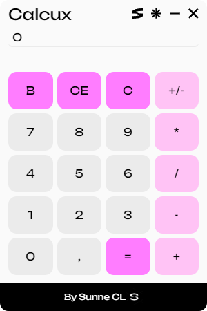
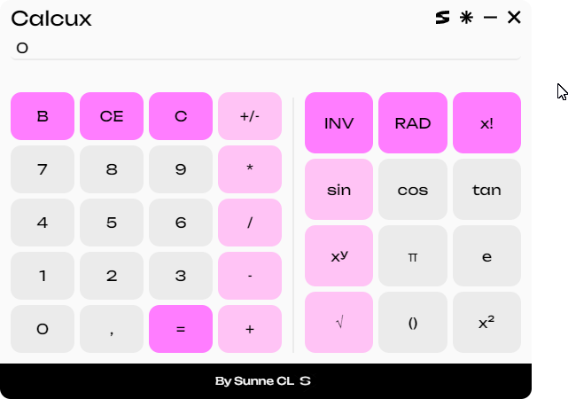
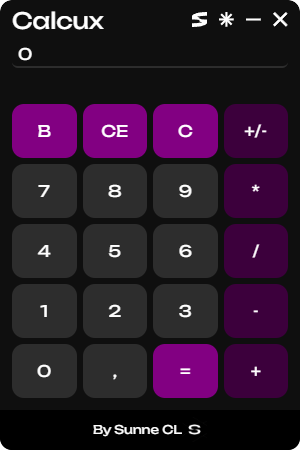
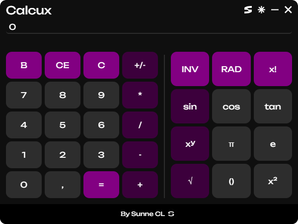

# Calcux

A desktop calculator application featuring standard and scientific modes with a clean, modern interface.

## Screenshots

## Features

- Standard arithmetic operations
- Scientific mode with trigonometric functions
- Inverse trigonometric functions
- Factorial, square root, and power operations
- Constants (pi, e)
- Parentheses support
- RAD/DEG angle mode switching
- Dark and light themes
- Expandable interface for the scientific panel

## Installation

You can download the application from the [Releases](https://github.com/sunne-cl/calcux/releases) page.

## Usage

- Click number and operator buttons to perform calculations.
- Click `=` to evaluate the expression.
- Use `INV` to switch to inverse functions (asin, acos, atan).
- Use `RAD`/`DEG` to toggle the angle mode.
- Click the expand button in the header to show or hide the scientific panel.
- Click the theme button to switch between light and dark modes.

## License

This project is licensed under the MIT License. See the [LICENSE](LICENSE) file for details.
